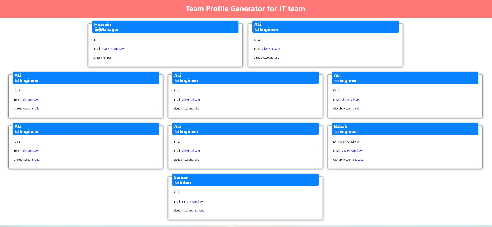
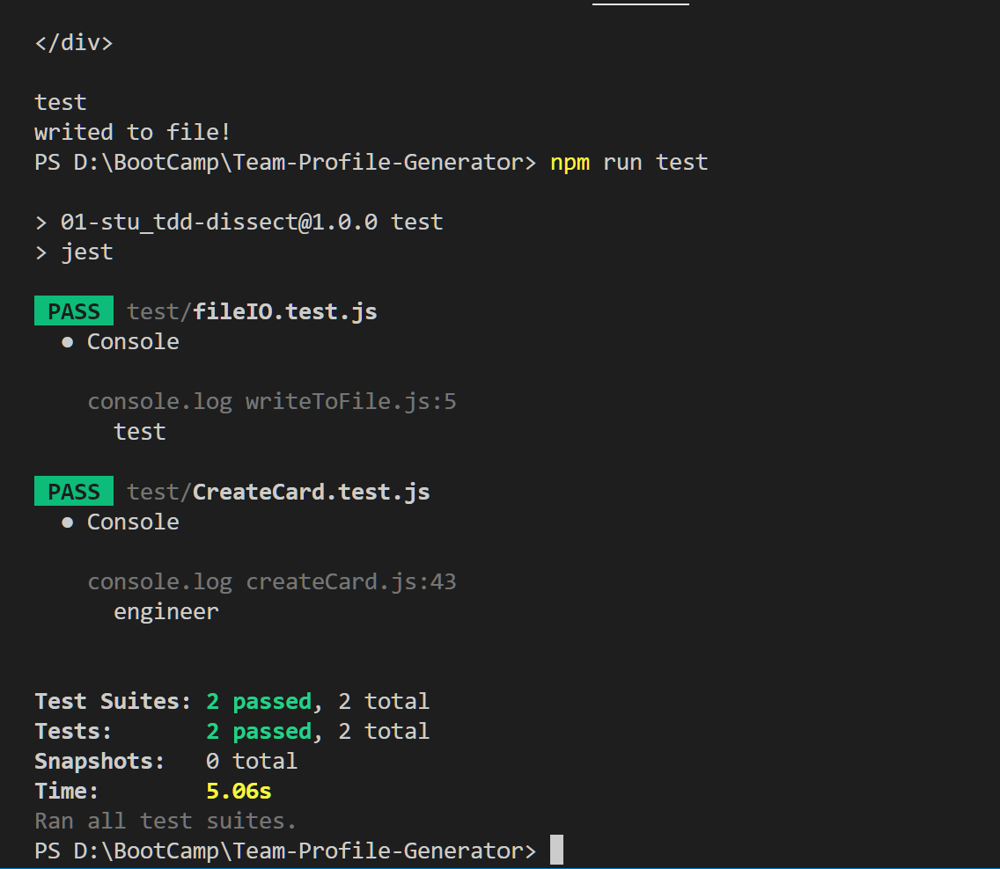
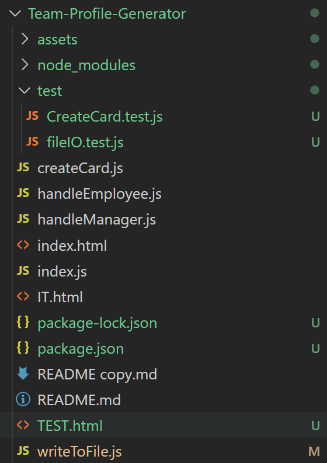

# Team Profile Generator

## Description 
This app task is to build a Node.js command-line application that takes in information about employees on a software engineering team, then generates an HTML webpage that displays summaries for each person. Testing is key to making code maintainable, so this app also has a unit test for part of code to ensure that it passes each test.

## Demo video:
https://drive.google.com/file/d/1ceXnVAqgC8eUejNTooz7f2W3w8zVmF9q/view

## github link 
https://github.com/neiman924

## Table of Contents

- [Installation](#installation)
- [Usage](#usage)
- [Credits](#credits)
- [License](#license)
- [Tests](#tests)
- [Questions](#questions)

## installation
The application will be invoked by using the following command: 
npm i => bash => “node index.js”

## usage
This app quickly and easily create a chart html file by using a command-line application to generate one. This allows the manager to has quick access to his coworkers information and and devote more time to working on the other projects.
    ## screenshot
    
    
    
 
## credits
none

## license
none

## tests
 This app also has a unit test for every part of your code and ensure that it passes each test.

## questions
- Please send me email if you had any questions, my email address is :
 neiman924@gmail.com

        